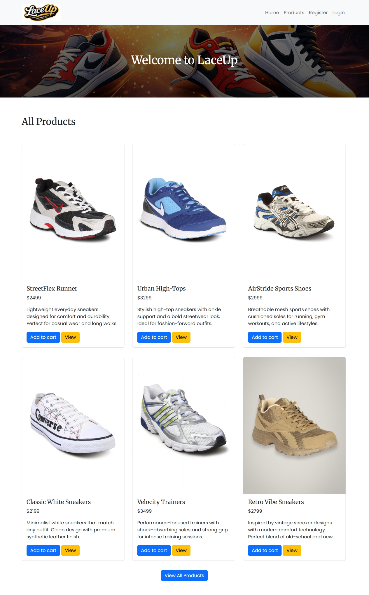
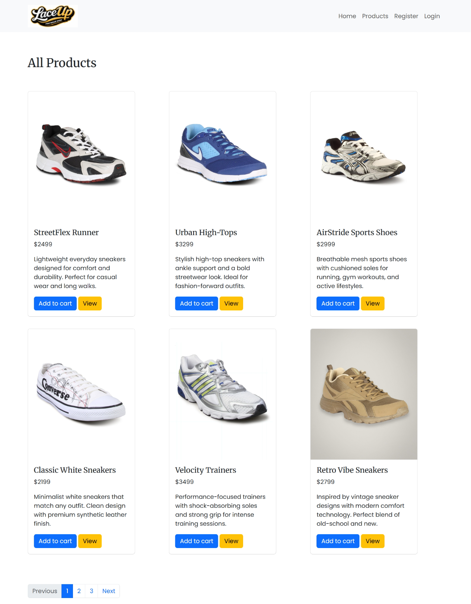
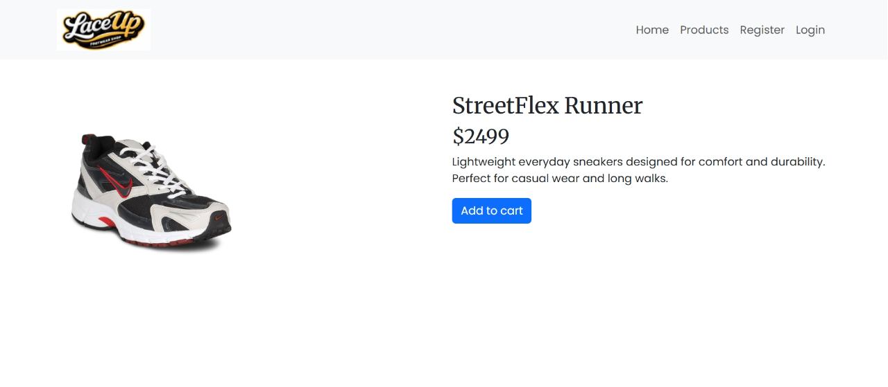

# 👟 LaceUp – Footwear Website

## 📌 Project Overview
**LaceUp** is a footwear-focused website built to practice and demonstrate my **web development fundamentals**.  
The project focuses on responsive design, frontend interactions, and basic backend integration using PHP and MySQL.

This project helped me understand how a simple web application is structured from **UI design to database connectivity**.

---

## 🛠️ Technologies Used

### Frontend
- HTML  
- CSS  
- JavaScript  
- Bootstrap  

### Backend
- PHP  
- MySQL  

---

## ✨ Features
- Responsive website layout  
- Footwear product listing design  
- Basic frontend interactivity using JavaScript  
- Backend integration using PHP  
- Data handling using MySQL  

---

## 🖼️ Screenshots

### Home Page

### Product Listing Page

### Product Details Page

---

## 📂 Project Structure
mini-ecom/
│
├── css/ # Stylesheets
├── js/ # JavaScript files
├── images/ # Images and assets
├── includes/ # PHP includes
├── index.php # Main entry file
├── db/ # Database-related files
├── screenshots/ # Project screenshots
└── README.md # Project documentation

---

## 🚀 How to Run the Project Locally

1. Install a local server such as **XAMPP** or **WAMP**
2. Place the project folder inside: htdocs (XAMPP)
3. Start **Apache** and **MySQL**
4. Import the database into **phpMyAdmin**
5. Open your browser and visit: http://localhost/mini-ecom
---

## 🎯 Learning Outcomes
Through this project, I learned:
- Structuring a basic web project  
- Creating responsive layouts using Bootstrap  
- Handling backend logic using PHP  
- Connecting a website to a MySQL database  
- Understanding frontend and backend integration  

---

## 🔮 Future Improvements
- Improve UI and responsiveness  
- Add product search and filtering  
- Enhance backend logic  
- Add basic analytics for insights  

---

## 👤 Author
**Anirudh B**  
- GitHub: [AnirudhDev01](https://github.com/AnirudhDev01)

---

⭐ **Note:**  
This project was built as a **learning-focused web development project** and will be improved as I continue to develop my skills.